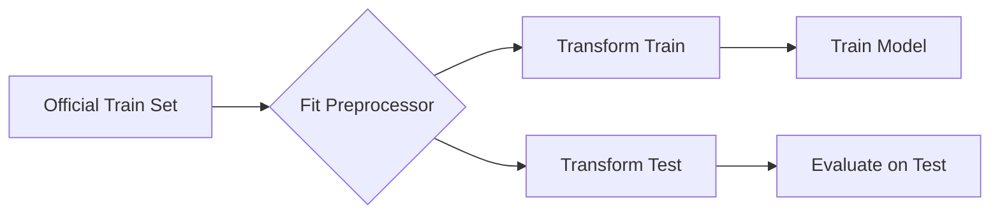

# Reproducibility

Reproducibility is a non-negotiable tenet of this research. This document outlines the mechanisms we use to ensure that any researcher can replicate our results exactly.

---

## 🌱 Seeding Strategy

All stochastic processes in the pipeline are controlled by **fixed random seeds**.

| Component | Controlled By | Default |
|-----------|---------------|---------|
| Data Splitting | `sklearn.model_selection` | `random_state=42` |
| Resampling (S2a/S2b) | `imblearn.RandomOverSampler` | `random_state=42` |
| Model Training | LR, RF, XGB instances | `random_state=42` |

**Configuration (`configs/main.yaml`):**
```yaml
experiments:
  seeds: [42, 43, 44, 45, 46]  # For multi-seed runs
```

---

## 📜 Data Contracts

We enforce strict contracts to prevent **data leakage** and ensure **feature consistency**. See the full contract: [Data Contract](../contracts/data_contract.md).

### Key Rules:

1.  **Split First**: Use official UNSW-NB15 train/test splits. Never mix.
2.  **Fit on Train Only**: All preprocessing transformations (scaling, encoding, imputation) are fitted exclusively on the training set.
3.  **Transform All**: The fitted transformers are then applied to validation and test sets.
4.  **No Touch Test**: The official test set is **untouched** until final evaluation.



---

## 📦 Environment Locking

Dependencies are frozen in `requirements.txt` to prevent version drift.

**Critical Dependencies:**

| Package | Version | Purpose |
|---------|---------|---------|
| `scikit-learn` | 1.3.x | Core ML framework |
| `xgboost` | 2.0.x | Gradient boosting |
| `imbalanced-learn` | 0.12.x | Resampling algorithms |
| `pandas` | 2.0.x | Data manipulation |
| `numpy` | 1.24.x | Numerical operations |

**To create an identical environment:**
```bash
python -m venv .venv
source .venv/bin/activate  # or .venv\Scripts\activate on Windows
pip install -r requirements.txt
```

---

## ✅ Verification Artifacts

After every experiment run, the following artifacts are generated to enable verification:

| Artifact | Path | Purpose |
|----------|------|---------|
| Preprocessing Metadata | `results/processed/preprocessing_metadata.json` | Feature names, class mappings |
| Experiment Log | `results/experiment_log.csv` | Timestamped record of all runs |
| Raw Metrics | `results/metrics/*.json` | Complete metrics per experiment |
| Configuration Snapshot | `configs/main.yaml` | The exact config used |

---

## 🔬 Reproducing Our Results

1.  Clone the repository at the specified commit.
2.  Install dependencies from `requirements.txt`.
3.  Ensure `dataset/UNSW_NB15_training-set.csv` and `dataset/UNSW_NB15_testing-set.csv` are present.
4.  Run:
    ```bash
    python main.py --config configs/main.yaml
    ```
5.  Compare your `results/metrics/*.json` against the published artifacts.
